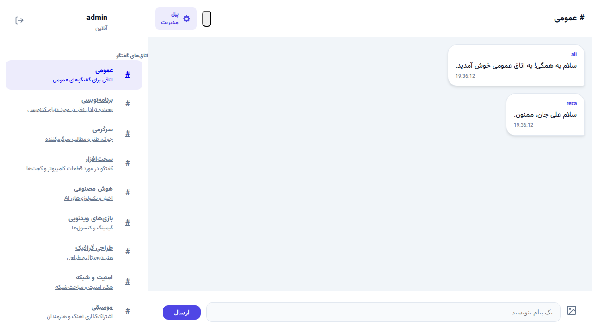
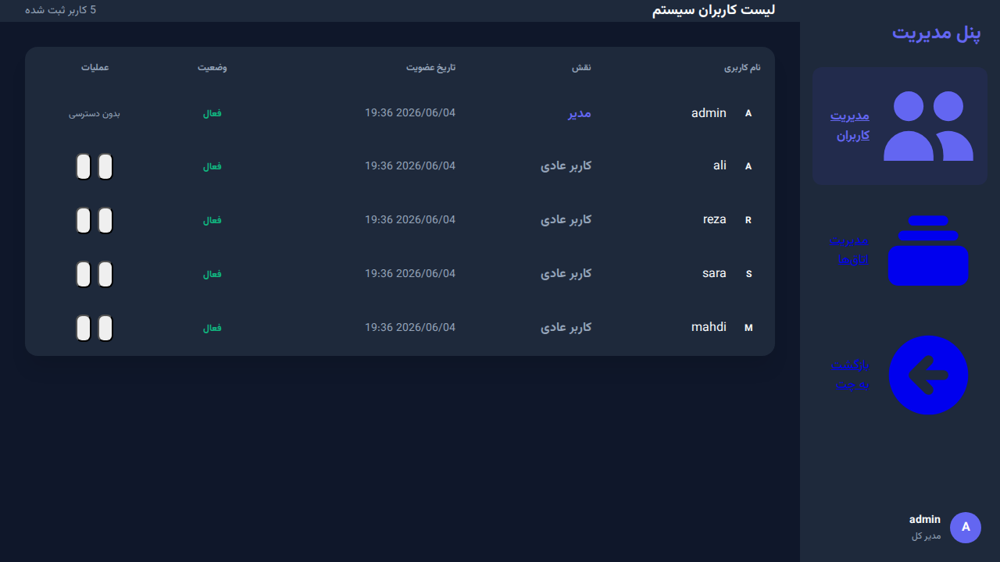
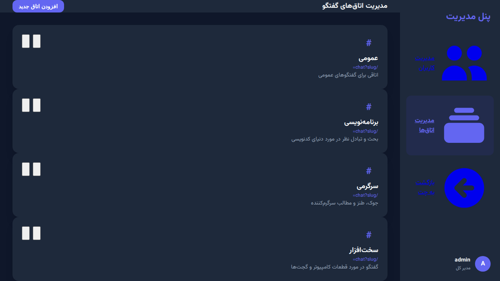

# پروژه چت‌روم پیشرفته JetRoom (PHP OOP MVC)

این پروژه یک سیستم چت‌روم مدرن، امن و با کارایی بالا است که با استفاده از PHP  (بدون فریم‌ورک) و بر پایه معماری شی‌گرا (OOP) و الگوی طراحی MVC توسعه یافته است. 

## اسکرین‌شات‌های محیط برنامه

### صفحه ورود (Login)


### محیط چت‌روم (تم تیره - Dark Mode)


### محیط چت‌روم (تم روشن - Light Mode)


### پیام خصوصی (Private Message)


### پنل مدیریت کاربران (Admin Users)


### پنل مدیریت اتاق‌ها (Admin Rooms)



## قابلیت‌های کلیدی

- **معماری MVC:** تفکیک کامل لایه‌های داده (Model)، نمایش (View) و منطق برنامه (Controller).
- **تم دوگانه (Dark/Light):** پشتیبانی از تم تاریک و روشن با قابلیت سوییچ آنی و ذخیره وضعیت.
- **پنل مدیریت پیشرفته:**
    - مدیریت کاربران (مشاهده لیست، مسدود سازی، رفع مسدودیت، حذف).
    - مدیریت اتاق‌ها (افزودن اتاق جدید، ویرایش نام، توضیحات و اسلاگ، حذف اتاق).
    - مدیریت پیام‌ها (حذف پیام‌های نامناسب توسط مدیر در لحظه).
- **سیستم چت‌روم موضوعی:** قابلیت ایجاد و مدیریت بی‌نهایت اتاق گفتگو با موضوعات متنوع.
- **پیام خصوصی (PV):** قابلیت گفتگو به صورت دو نفره و کاملاً امن.
- **ارسال عکس:** پشتیبانی از آپلود تصاویر در چت‌روم‌ها و پیام‌های خصوصی با اعتبارسنجی دقیق.
- **پشتیبانی از چند دیتابیس:** قابلیت سوئیچ آسان بین SQLite و MySQL تنها با تغییر در فایل کانفیگ.
- **امنیت پیشرفته:**
    - جلوگیری از SQL Injection با استفاده از PDO Prepared Statements.
    - جلوگیری از XSS با پاکسازی خودکار ورودی‌ها و خروجی‌ها.
    - هش کردن رمزهای عبور با الگوریتم password_hash.
    - امنیت بالای آپلود فایل (بررسی Mime-type و تغییر نام تصافی).
    - کنترل سطح دسترسی (RBAC) برای محافظت از بخش مدیریت.
- **رابط کاربری مدرن:** طراحی دو ستونه، کاملاً واکنش‌گرا (Responsive) و راست‌چین (RTL) با دکمه‌ها و اینپوت‌های بهبود یافته.
- **به‌روزرسانی خودکار:** مشاهده پیام‌های جدید بدون نیاز به رفرش صفحه با استفاده از JavaScript Fetch API.

## ساختار پوشه‌بندی

```text
/
├── app/                # کدهای اصلی بک‌آند
│   ├── Config/         # تنظیمات دیتابیس و برنامه
│   ├── Controllers/    # کنترلرهای MVC
│   ├── Core/           # هسته سیستم (Router, Database, Base Classes)
│   └── Models/         # مدل‌های داده‌ای
├── public/             # فایل‌های عمومی و نقطه ورود برنامه
│   ├── static/         # دارایی‌های ثابت (CSS, JS, Images)
│   ├── uploads/        # محل ذخیره تصاویر آپلود شده
│   └── index.php       # نقطه ورود اصلی (Front Controller)
├── views/              # فایل‌های لایه نمایش (Template Files)
├── screenshots/        # اسکرین‌شات‌های محیط برنامه
├── readmeapi.md        # مستندات فنی و معماری
└── README.md           # راهنمای جامع پروژه
```

## راهنمای راه‌اندازی

### پیش‌نیازها
- PHP نسخه 7.4 یا بالاتر
- وب‌سرور (Apache/Nginx) مانند XAMPP یا Laragon
- افزونه‌های PDO برای MySQL یا SQLite

### مراحل نصب
1. پروژه را در پوشه `htdocs` وب‌سرور خود کپی کنید.
2. **تنظیم دیتابیس:**
   - به فایل `app/Config/config.php` بروید.
   - برای استفاده از **SQLite** (بدون نیاز به نصب سرور دیتابیس): مقدار `DB_TYPE` را روی `sqlite` قرار دهید. دیتابیس به صورت خودکار در `app/Database/chatroom.sqlite` ساخته می‌شود.
   - برای استفاده از **MySQL**: مقدار `DB_TYPE` را روی `mysql` قرار دهید و مشخصات سرور خود را وارد کنید.
3. مرورگر را باز کرده و آدرس پروژه را وارد کنید (مثلاً `http://localhost/chatroom/public`).
4. **اطلاعات ورود ادمین پیش‌فرض:**
   - نام کاربری: `admin`
   - رمز عبور: `admin123`
