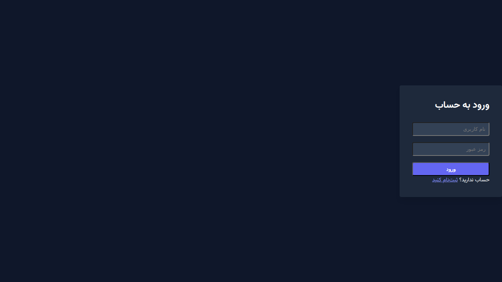
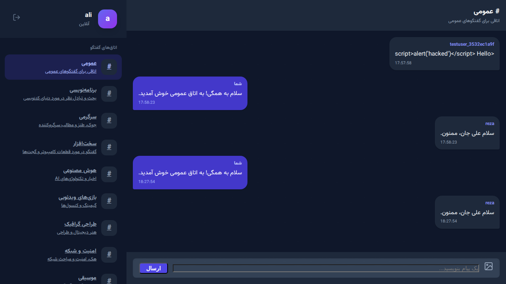
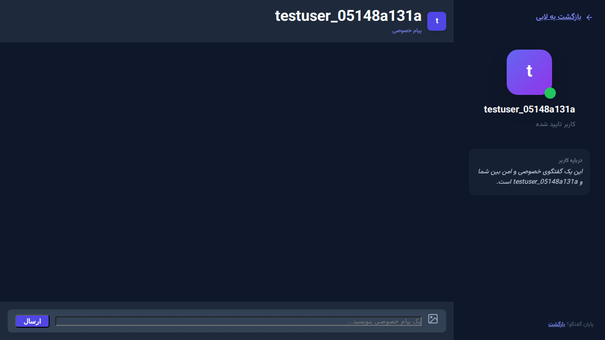

# پروژه چت‌روم پیشرفته JetRoom (PHP OOP MVC)

این پروژه یک سیستم چت‌روم مدرن، امن و با کارایی بالا است که با استفاده از PHP خام (بدون فریم‌ورک) و بر پایه معماری شی‌گرا (OOP) و الگوی طراحی MVC توسعه یافته است. ظاهر برنامه با الهام از دیسکورد و تلگرام، به صورت کاملاً مدرن و با استفاده از Tailwind CSS طراحی شده است.

## قابلیت‌های کلیدی

- **معماری MVC:** تفکیک کامل لایه‌های داده (Model)، نمایش (View) و منطق برنامه (Controller).
- **سیستم ۱۰ چت‌روم موضوعی:** دارای اتاق‌های گفتگو با موضوعات متنوع (برنامه‌نویسی، سخت‌افزار، عمومی و غیره).
- **پیام خصوصی (PV):** قابلیت گفتگو به صورت دو نفره و کاملاً امن.
- **ارسال عکس:** پشتیبانی از آپلود تصاویر در چت‌روم‌ها و پیام‌های خصوصی با اعتبارسنجی دقیق.
- **پشتیبانی از چند دیتابیس:** قابلیت سوئیچ آسان بین SQLite و MySQL تنها با تغییر در فایل کانفیگ.
- **امنیت پیشرفته:**
    - جلوگیری از SQL Injection با استفاده از PDO Prepared Statements.
    - جلوگیری از XSS با پاکسازی خودکار ورودی‌ها و خروجی‌ها.
    - هش کردن رمزهای عبور با الگوریتم password_hash.
    - امنیت بالای آپلود فایل (بررسی Mime-type و تغییر نام تصادفی).
- **رابط کاربری مدرن:** طراحی دو ستونه، کاملاً واکنش‌گرا (Responsive) و راست‌چین (RTL) با تم تاریک.
- **به‌روزرسانی خودکار:** مشاهده پیام‌های جدید بدون نیاز به رفرش صفحه با استفاده از JavaScript Fetch API.

## ساختار پوشه‌بندی

```text
/
├── app/                # کدهای اصلی بک‌آند
│   ├── Config/         # تنظیمات دیتابیس و برنامه
│   ├── Controllers/    # کنترلرهای MVC
│   ├── Core/           # هسته سیستم (Router, Database, Base Classes)
│   └── Models/         # مدل‌های داده‌ای
├── public/             # فایل‌های عمومی و نقطه ورود برنامه
│   ├── static/         # دارایی‌های ثابت (CSS, JS, Images)
│   ├── uploads/        # محل ذخیره تصاویر آپلود شده
│   └── index.php       # نقطه ورود اصلی (Front Controller)
├── views/              # فایل‌های لایه نمایش (Template Files)
├── screenshots/        # اسکرین‌شات‌های محیط برنامه
├── readmeapi.md        # مستندات فنی و معماری
└── README.md           # راهنمای جامع پروژه
```

## راهنمای راه‌اندازی

### پیش‌نیازها
- PHP نسخه 7.4 یا بالاتر
- وب‌سرور (Apache/Nginx) مانند XAMPP یا Laragon
- افزونه‌های PDO برای MySQL یا SQLite

### مراحل نصب
1. پروژه را در پوشه `htdocs` وب‌سرور خود کپی کنید.
2. **تنظیم دیتابیس:**
   - به فایل `app/Config/config.php` بروید.
   - برای استفاده از **SQLite** (بدون نیاز به نصب سرور دیتابیس): مقدار `DB_TYPE` را روی `sqlite` قرار دهید. دیتابیس به صورت خودکار در `app/Database/chatroom.sqlite` ساخته می‌شود.
   - برای استفاده از **MySQL**: مقدار `DB_TYPE` را روی `mysql` قرار دهید و مشخصات سرور خود را وارد کنید. سپس کوئری‌های موجود در انتهای این فایل را در دیتابیس خود اجرا کنید.
3. مرورگر را باز کرده و آدرس پروژه را وارد کنید (مثلاً `http://localhost/chatroom/public`).

## اسکرین‌شات‌های محیط برنامه

### صفحه ورود (Login)


### محیط چت‌روم عمومی (Telegram Style)


### پیام خصوصی (Private Message)


## کوئری‌های ساخت دیتابیس (برای MySQL)

```sql
CREATE TABLE users (
    id INT AUTO_INCREMENT PRIMARY KEY,
    username VARCHAR(50) NOT NULL UNIQUE,
    password VARCHAR(255) NOT NULL,
    created_at TIMESTAMP DEFAULT CURRENT_TIMESTAMP
);

CREATE TABLE rooms (
    id INT AUTO_INCREMENT PRIMARY KEY,
    name VARCHAR(100) NOT NULL,
    description TEXT,
    slug VARCHAR(100) NOT NULL UNIQUE
);

CREATE TABLE messages (
    id INT AUTO_INCREMENT PRIMARY KEY,
    user_id INT NOT NULL,
    room_id INT NOT NULL,
    message TEXT,
    image_path VARCHAR(255),
    created_at TIMESTAMP DEFAULT CURRENT_TIMESTAMP,
    FOREIGN KEY (user_id) REFERENCES users(id),
    FOREIGN KEY (room_id) REFERENCES rooms(id)
);

CREATE TABLE private_messages (
    id INT AUTO_INCREMENT PRIMARY KEY,
    sender_id INT NOT NULL,
    receiver_id INT NOT NULL,
    message TEXT,
    image_path VARCHAR(255),
    created_at TIMESTAMP DEFAULT CURRENT_TIMESTAMP,
    FOREIGN KEY (sender_id) REFERENCES users(id),
    FOREIGN KEY (receiver_id) REFERENCES users(id)
);

-- درج اتاق‌های پیش‌فرض
INSERT INTO rooms (name, description, slug) VALUES
('عمومی', 'اتاقی برای گفتگوهای عمومی', 'general'),
('برنامه‌نویسی', 'بحث و تبادل نظر در مورد دنیای کدنویسی', 'programming'),
('سرگرمی', 'جوک، طنز و مطالب سرگرم‌کننده', 'fun'),
('سخت‌افزار', 'گفتگو در مورد قطعات کامپیوتر و گجت‌ها', 'hardware'),
('هوش مصنوعی', 'اخبار و تکنولوژی‌های AI', 'ai'),
('بازی‌های ویدئویی', 'گیمینگ و کنسول‌ها', 'gaming'),
('طراحی گرافیک', 'هنر دیجیتال و طراحی', 'design'),
('امنیت و شبکه', 'هک، امنیت و مباحث شبکه', 'security'),
('موسیقی', 'اشتراک‌گذاری آهنگ و بحث‌های موزیکال', 'music'),
('تکنولوژی', 'آخرین اخبار دنیای تکنولوژی', 'tech');
```
